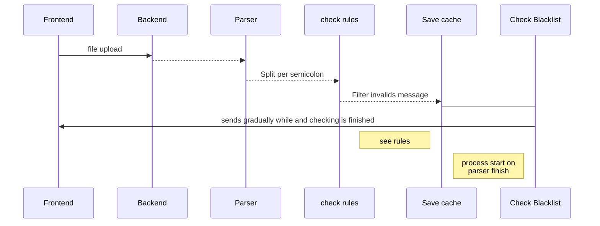

# Test PG Mais

  

Parse a text file, with messages and return a ID and Broker of valid messages;

  

- example of accepted :

663b9f69-6b67-4a5b-bd1a-3266f2ad8a01;85;967009811;VIVO;06:27:38;I'm gonna drink 'til I reboot.

- return exemple:

663b9f69-6b67-4a5b-bd1a-3266f2ad8a01;1

More exemples of [accepted](https://raw.githubusercontent.com/z22092/teste-pgplus/master/_data_/29f650e0-04cc-11eb-9342-fb56f8d6040d.txt) and [return](https://raw.githubusercontent.com/z22092/teste-pgplus/master/_data_/1601656364.txt) 
  

## - How to run -

There is a Makefile at the root of the project with useful commands;

- make build: build a docker image used to run the system and upload the container instances;

- make up: up as instances of the container without the image build;

- make down: drops the container instances;

- make logs: Shows the container logs;

There is a .env inside the folder that loads some useful settings:

- APPNAME=teste-pgplus

- TAG=master-v0.1

- List item

- ALPINE_VERSION=3.11

- PHP_VERSION=7.4

- HOSTPORT=8080

- DOCKERPORT=8080

  
  

1. To run just run the command "make build", wait it finish, and done   

2. Then just access the address http://localhost:8080  

3. Click on de box

  

4. Upload file and wait finish   

5. Click to download parsed text file

  

  
  

## - Used technologies -

  

**OS**

- Pop!_OS: 20.04

- Alpine: 3.11 \\\Docker Image

  

**IDE**

- Visual Studio Code: Latest

  

**Langs Frontend**

- Javascript (frontend)

- HTML (frontend)

- CSS (frontend)

**Langs Backend**

- PHP: 7.4

**DB**

- Redis: Latest

**Libs**

- Symfony/http-client: 5.1

  

**Build**

- Makefile \ Shell script

- Docker \ Docker-compose

  

## - Operation diagram -

  

  

## - Rules -

  

- Checks if the phone number is a valid Brazilian number

- Checks whether the local phone code (DDD) is a valid code

- Blocked Message by location

- Block messages after 19:59:59

- Maximum number of characters allowed 140

- Check if more than one message is being sent and only send the most recent valid message

  

 

  

**Blocked location**

|DDD|REGION|STATE|

|--|----------------------|---------|

|11|São Paulo |São Paulo|

|12|São José dos Campos |São Paulo|

|13|Santos |São Paulo|

|14|Bauru |São Paulo|

|15|Sorocaba |São Paulo|

|16|Ribeirão Preto |São Paulo|

|17|São José do Rio Preto |São Paulo|

|18|Presidente Prudente |São Paulo|

|19|Campinas |São Paulo|

  

 

  

**Broker ID**

|ID_BROKER | OPERADORAS|

|--|--|

|1| VIVO, TIM|

|2 |CLARO, OI|

|3 |NEXTEL|

  

 

  
  

## Bonus

A dynamic message generator was created following the accepted standard

  

## - How to run -

  

Open the console, go to the "gerador" folder at the project root

And do the commands:

  

$ npm i

for generate file run:

  

$ node index.js $number_of_lines

  

number_of_lines = Number of lines you want to generate;

  

The file that will be generated will be inside the "files" folder

## - Used technologies -

**Langs**

- Node: v12.16.3

**Libs**

- axios: 0.20.0

- moment: 2.29.0

- uuid: 8.3.0

**Quotes**

- Futurama API: http://futuramaapi.herokuapp.com (Bender Characters)

  

 

  

# Steps

  

- [x] README

- [x] What was used

- [x] Execution instructions

- [ ] Test instructions 😥

- [ ] Unit test 😥

- [ ] Documents 😥
